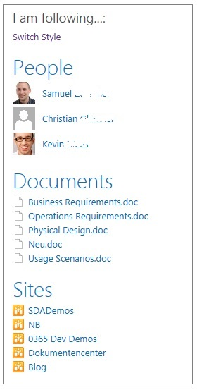
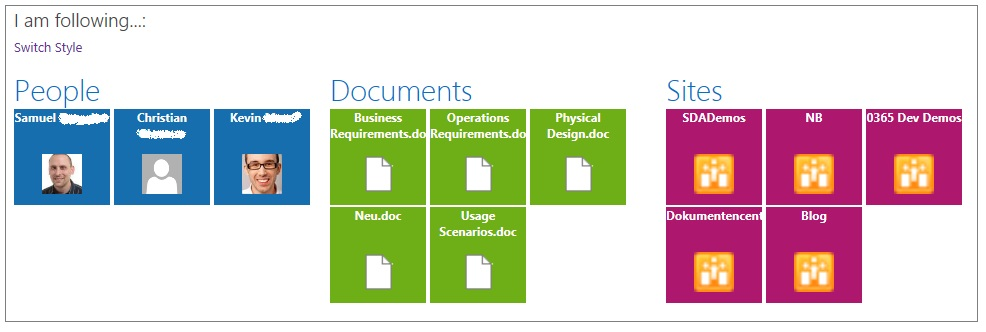

# Iamfollowing
Backup off https://iamfollowing.codeplex.com/

Populated this readme from: http://www.sharepointtalk.net/2013/07/i-am-following.html

Works with SharePoint 2013, 2016 on-prem or with O365 / SharePoint Online

A new feature in SharePoint 2013 is „Following“. Users can follow nearly everything in SharePoint 2013. Not so nice is the fact that you only can get an overview of WHAT you are following using your MySite. The WebParts / List used to store and aggregate that data are not usable in any TeamSite etc. First thought was that the new and hyped SearchDriven technique could be the way to aggregate all the content a person followed also outside the MySite. FAILED. The content for example stored under “Site contents -> Social” in every MySite cannot be found using search. Also the suggestion part of the Following Feature is not based on Search Analytics

You get a JSON result set with information which documents, persons and sites the user fired the query is following.
Using this JSON result and some jQuery magic we can generate a WebPart containing this information in a list view or in METRO style

Using for example that method:
GET  http://<siteCollection>/<site>/_api/social.following/my/followed(types=15)

You get a JSON result set with information which documents, persons and sites the user fired the query is following.
Using this JSON result and some jQuery magic we can generate a WebPart containing this information in a list view:

Ore the same information as in METRO style:

